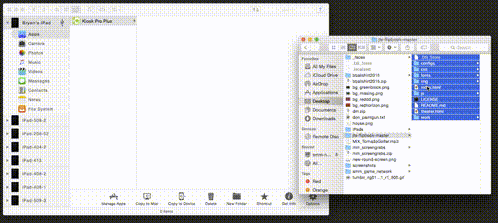

## Journey to Space - Digital Flip Book

### About
Swipeable slideshow for iPad tablets. This app generates a series of full-screen slides from a configuration file and linked images. It can be used to make multiple iPad slideshows, each with unique content. See examples of the flipbook xml structure in configs directory.

### Hardware Setup
* If iPad is new, start with [Fresh Out of Box Configuration](http://projects.smm.org/atrium/media/node/291625).
* Launch the App Store, search for "Kiosk Pro Plus" and install.
* If asked, use LastPass credentials found under "Apple ID - sld.tech".
* Update settings to match the [Settings for use with Kiosk Pro Plus](http://projects.smm.org/atrium/media/node/291625). 

### Install Flipbook Content
* Clone this repository into a new folder on your Desktop.
* Copy the *img* folder from ```Shared/Projects/Journey to Space (SPACE)/Multimedia/DigitalFlipbooks/jts-flipbook/img/``` into the root of your new folder. 
* Inside ```index.html```, change the ```data-config``` inside the body tag to the path of the flipbook xml that represents whichever flipbook you want to use.

```html
<body data-config="configs/404.xml">
```

#### English/French Mode (Overriding default English/Spanish mode)
* (Optional) In the same ```index.html``` body tag, add (or edit) a ```secondary-language``` and ```secondary-language-label``` property. These properties default to Español (es) when omitted, but can override which language-key is targeted in the config files as well as the label of the language button.

```html
<body data-config="configs/404.xml" secondary-language="fr" secondary-language-label="Français">
```

* Transfer files to iPad using [iMazing](http://imazing.com/) software.
  1. Connect iPad to computer via USB. 
  2. Open iMazing application. Select iPad from sidebar. 
  3. Navigate to Apps > KioskPro.
  4. Drag all files & folders from your 'jts-flipbook' folder into the KioskPro root folder within iMazing. (index.html MUST be in root)
  
  

### Launching Flipbook
1. On the iPad, launch **Kiosk Pro Plus**, which is now configured to display your flipbook.
2. Enable Guided Access by Triple-pressing the Home button.

